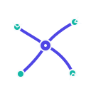

<p align="center">
  
</p>

<h1 align="center">Stringwork</h1>

<p align="center">
  An MCP server for orchestrating AI coding agents. One driver (e.g. Cursor) directs multiple workers (Claude Code, Codex, Gemini CLI) through shared tasks, messaging, plans, and progress monitoring — all from a single Go binary.
</p>

## Install

```bash
curl -fsSL https://raw.githubusercontent.com/jaakkos/stringwork/main/scripts/install.sh | sh
```

Supports macOS (arm64, amd64) and Linux (amd64, arm64). Pass `--version v0.1.0` for a specific release or `--dir /usr/local/bin` to change the install location.

Or build from source:

```bash
go build -o mcp-stringwork ./cmd/mcp-server
```

## How It Works

Stringwork uses a **driver/worker** model:

```
  Driver (Cursor)
       |
       |-- creates tasks, monitors progress, cancels stuck workers
       |
       +-- Worker 1 (Claude Code)  -- claims tasks, reports progress, sends findings
       +-- Worker 2 (Codex)        -- claims tasks, reports progress, sends findings
       +-- Worker 3 (Gemini CLI)   -- claims tasks, reports progress, sends findings
       +-- Worker N (any agent)    -- ...
```

- The **driver** creates tasks (with `assigned_to='any'` for auto-assignment), monitors workers via `worker_status`, and cancels stuck agents with `cancel_agent`.
- **Workers** are spawned automatically by the server when there's pending work. They claim tasks, report progress every 2-3 minutes, and communicate findings back via messages.
- All agents share state through a single SQLite file (`~/.config/stringwork/state.sqlite`).

The server provides only coordination tools. Each agent uses its own native capabilities for file editing, search, git, and terminal.

## Features

- **Driver/worker orchestration** -- one driver, N workers with automatic spawning, SLA monitoring, and cancellation
- **Task management** -- create, assign, track, and auto-notify on task lifecycle events
- **Messaging** -- inter-agent messages with urgency, piggyback notifications on every tool call
- **Shared planning** -- collaborative plans with items, acceptance criteria, and progress tracking
- **Progress monitoring** -- mandatory heartbeats and progress reports; escalating alerts (3 min warning, 5 min critical, 10 min auto-recovery)
- **File locks** -- prevent simultaneous edits across agents
- **Knowledge indexing** -- FTS5-powered project knowledge base (markdown, Go source, session notes, task summaries)
- **Web dashboard** -- real-time view of tasks, workers, messages, and plans (URL logged on startup)
- **Auto-respond** -- server spawns agents when they have unread messages, no external daemon needed
- **Git worktree isolation** -- optional per-worker checkouts to prevent file conflicts
- **Dynamic workspace** -- switch projects at runtime via `set_presence workspace='...'`
- **Custom agents** -- register any MCP client as a participant via `register_agent`

## Quick Start

### 1. Configure Cursor

Add to `.cursor/mcp.json` in your project:

```json
{
  "mcpServers": {
    "stringwork": {
      "command": "mcp-stringwork",
      "env": { "MCP_CONFIG": "/path/to/config.yaml" }
    }
  }
}
```

Cursor spawns the server as a subprocess via stdio. The server also starts an HTTP listener in the background for workers and the dashboard -- **no daemon or background process needed**.

### 2. Create a config file

Copy `mcp/config.yaml` and customize. Minimal example:

```yaml
workspace_root: "/path/to/your/project"
enabled_tools: ["*"]

# Port 0 = auto-assign (supports multiple Cursor windows).
# Set a fixed port (e.g. 8943) for a predictable dashboard URL.
http_port: 0

orchestration:
  driver: cursor
  workers:
    - type: claude-code
      instances: 1
      command: ["claude", "-p", "You are claude-code. Steps: 1) set_presence 2) read_messages 3) list_tasks 4) Do the work 5) report_progress 6) send_message with findings.", "--dangerously-skip-permissions"]
      timeout_seconds: 600
```

### 3. Start working

Open Cursor -- the server starts automatically. Create tasks, workers get spawned:

```
# Driver (Cursor) creates a task
create_task title='Add auth middleware' assigned_to='any' created_by='cursor'

# Server spawns a worker, which claims and works on it
# Driver monitors via:
worker_status
```

### Multiple Cursor windows

Each Cursor window spawns its own server instance. With `http_port: 0` (default), each gets an auto-assigned port so they don't conflict. All instances share the same SQLite state file, so tasks and messages are visible across all windows.

## Configuration

### Orchestration

```yaml
orchestration:
  driver: cursor                          # which agent is the driver
  assignment_strategy: least_loaded       # or capability_match
  heartbeat_interval_seconds: 30
  worker_timeout_seconds: 120
  worktrees:
    enabled: false                        # git worktree isolation per worker
  workers:
    - type: claude-code
      instances: 2                        # run up to 2 Claude Code workers
      command: ["claude", "-p", "...", "--dangerously-skip-permissions"]
      cooldown_seconds: 30
      timeout_seconds: 600
      max_retries: 2
      env:
        GH_TOKEN: "${GH_TOKEN}"           # ${VAR} expands from server env
        SSH_AUTH_SOCK: "${SSH_AUTH_SOCK}"
      # inherit_env: ["HOME", "PATH", "GH_*", "SSH_*"]  # restrict inherited env
    - type: codex
      instances: 1
      command: ["codex", "exec", "--sandbox", "danger-full-access", "--skip-git-repo-check", "..."]
    - type: gemini
      instances: 1
      command: ["gemini", "--yolo", "--prompt", "..."]
      env:
        GOOGLE_API_KEY: "${GOOGLE_API_KEY}"
```

See [mcp/config.yaml](mcp/config.yaml) for a fully annotated example.

## Available Tools (23)

### Session
| Tool | Description |
|------|-------------|
| `get_context` | Full session context (messages, tasks, presence, plans) |
| `set_presence` | Update status and workspace; dynamically changes server's project context |
| `add_note` | Add shared note or decision |

### Communication
| Tool | Description |
|------|-------------|
| `send_message` | Message an agent (optional title, urgency) |
| `read_messages` | Read and mark messages as read |

### Tasks
| Tool | Description |
|------|-------------|
| `create_task` | Create task with optional work context (relevant_files, background, constraints) |
| `list_tasks` | List tasks with filters |
| `update_task` | Update status, assignment, priority; auto-notifies on completion |

### Planning
| Tool | Description |
|------|-------------|
| `create_plan` | Create shared plan |
| `get_plan` | View plan(s); omit ID to list all |
| `update_plan` | Add or update plan items with acceptance criteria |

### Workflow
| Tool | Description |
|------|-------------|
| `handoff` | Hand off work with summary and next steps |
| `claim_next` | Claim next task (dry_run to peek) |
| `request_review` | Request code review from an agent |

### Orchestration (driver/worker)
| Tool | Description |
|------|-------------|
| `worker_status` | Live view of workers: progress, SLA status, process activity |
| `heartbeat` | Signal liveness every 60-90s with progress info |
| `report_progress` | Structured progress: description, percent complete, ETA |
| `cancel_agent` | Cancel a worker's tasks, send STOP signal, kill process |
| `get_work_context` | Get task context (files, background, constraints, notes) |
| `update_work_context` | Add shared notes to a task's work context |

### Infrastructure
| Tool | Description |
|------|-------------|
| `lock_file` | Lock, unlock, check, or list file locks |
| `register_agent` | Register a custom agent for collaboration |
| `list_agents` | List all available agents (built-in and registered) |

## CLI

```bash
mcp-stringwork                          # start MCP server (normal operation)
mcp-stringwork --version                # print version
mcp-stringwork status claude-code       # check unread/pending counts for an agent
```

## Project Structure

```
.
├── cmd/mcp-server/          # Server entrypoint, CLI
├── internal/
│   ├── domain/              # Core entities (Message, Task, Plan, AgentInstance, ...)
│   ├── app/                 # Application services (CollabService, WorkerManager, Watchdog, Orchestrator)
│   ├── repository/sqlite/   # State persistence (SQLite)
│   ├── policy/              # Workspace validation, config, safety policy
│   ├── dashboard/           # Web dashboard (HTML + REST API)
│   ├── knowledge/           # FTS5 project knowledge indexer
│   ├── worktree/            # Git worktree manager for worker isolation
│   └── tools/collab/        # 23 MCP tool handlers
├── mcp/                     # Configuration files
├── scripts/                 # Install script
├── docs/                    # Documentation
├── .github/workflows/       # CI and release automation
├── AGENTS.md                # Cursor agent instructions
└── CLAUDE.md                # Claude Code agent instructions
```

## Documentation

- [Setup Guide](docs/SETUP_GUIDE.md) -- installation, client config, orchestration setup
- [Workflow](docs/WORKFLOW.md) -- collaboration patterns and best practices
- [Quick Reference](docs/QUICK_REFERENCE.md) -- tool usage examples
- [Architecture](docs/ARCHITECTURE.md) -- clean architecture overview
- [Client Configs](docs/mcp-client-configs/README.md) -- Cursor and Claude Code specifics