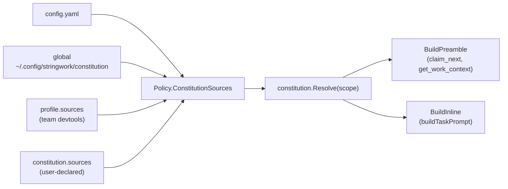

# Constitution

The constitution is the layered, file-backed prompt Stringwork prepends to
every worker. It is the answer to the question "what does my team always
want every agent to know before doing anything?".

It is inspired by the spirit of [unclebob/swarm-forge](https://github.com/unclebob/swarm-forge):
keep team rules in plain markdown, in version control, and let the
orchestrator do the work of injecting them.

## What the constitution does

1. **Preamble in coordination tools.** When a worker calls `claim_next` or
   `get_work_context`, the response includes a short preamble listing the
   resolved files in priority order. Workers are instructed to read them
   before doing anything else. The preamble is omitted on `claim_next
   dry_run=true` peeks (those return single-line JSON for callers that
   parse it programmatically); it appears on the actual claim.
2. **Inlined into spawn prompts.** When the server spawns a worker for a
   task, the full text of every resolved file is embedded into the spawn
   prompt before the task description block. This means the worker sees
   the rules even if it never calls a Stringwork tool.
3. **Conflict order.** The first file wins. Later files refine; they do
   not contradict. This is the same model swarm-forge uses for prompt
   stacking and the same model Cursor uses for `.cursor/rules`.

## File layout

A constitution lives on disk as a directory of markdown files. The
default location is `~/.config/stringwork/constitution/`.

```
~/.config/stringwork/constitution/
├── constitution.md      # Optional entry point. Documents reading order.
├── engineering.md       # Example: language-agnostic engineering rules.
├── security.md          # Example: secrets / private data rules.
└── reviews.md           # Example: PR review checklist (scope: review).
```

`constitution.md` is special only in one way: if it contains a markdown
ordered list, that list defines the order in which the other files are
read. Files not in the list appear after the listed files, in
alphabetical order. If `constitution.md` is missing, every `.md` file in
the directory is included alphabetically.

Every other file is just markdown. Keep them small and focused — the
contents are inlined into every prompt, so length matters.

## CLI

Manage the constitution from the command line; no daemon required.

```bash
# Scaffold a starter constitution at ~/.config/stringwork/constitution/.
mcp-stringwork constitution init

# Print the resolved preamble (the same text injected into MCP responses).
mcp-stringwork constitution show

# Print the inlined version (the same text injected into spawn prompts).
mcp-stringwork constitution show --inline

# Preview what a review-flavoured task would receive.
mcp-stringwork constitution show --task-kind review

# Pull every configured 'git' source into its cache. No-op for 'dir'
# sources. Run this whenever a team source publishes a new ref.
mcp-stringwork constitution sync

# Validate every source: directory exists, files match include globs,
# git remotes respond. Exits non-zero on any ERROR; missing
# global directory is a WARN with a hint to run `init`.
mcp-stringwork constitution doctor
```

## Sources

Every constitution is a stack of **sources**. Each source is a place to
read markdown files from. The resolver concatenates all sources in
declaration order, applies scope filters, and returns the final file
list.

### Built-in source: global

Every Stringwork install gets one source for free, named `global`,
pointing at `~/.config/stringwork/constitution/`. This is the per-user
constitution; running `constitution init` populates it.

### User-declared sources

Add more sources in `config.yaml`:

```yaml
constitution:
  sources:
    # A second local directory (e.g. a personal cheatsheet).
    - name: my-rules
      type: dir
      path: ~/work/personal-rules
      include: ["*.md"]

    # A team-wide rule pack pulled from a git remote.
    - name: team-rules
      type: git
      repo: git@github.com:my-org/team-rules.git
      ref: main
      paths: ["rules", "instructions"]
      cache_dir: ~/.cache/stringwork/team-rules
      scope:
        task_kind: ["review"]   # only attached to review-style tasks
```

`dir` sources are read live from the filesystem. `git` sources are
shallow-cloned into `cache_dir` and refreshed via `mcp-stringwork
constitution sync` — never on the hot path of `claim_next`.

Path tokens supported in `path`, `cache_dir`, and `paths`:

- `~` / `~/...` — user home directory.
- `$VAR` / `${VAR}` — environment variables.
- `$PROFILE_DIR` — only inside team profile files; resolves to the
  directory of the profile file itself.

## Scope filtering

Sources can be scoped so they only attach to certain tasks.

```yaml
- name: review-checklists
  type: dir
  path: ~/.config/stringwork/review-rules
  scope:
    task_kind: ["review"]
    agent_roles: ["reviewer"]   # optional, matches AgentInstance.Role
```

The `task_kind` field is derived from a task's title via the
`TaskKindFromTitle` heuristic. The only kind that heuristic currently
emits is `"review"` (titles containing the word `review`, `code review`,
or `pr review` all map to it). A future iteration could swap this for
an explicit `task.kind` field on `domain.Task`; sources scoped to
`task_kind: ["review"]` will keep working either way.

Empty scope filters mean "always match".

## Team profiles (cross-team sharing)

When a team already has a devtools repo (rules, style guides, review
checklists), they can publish a **profile** alongside it instead of
asking every developer to maintain their own `constitution.sources`
block. See [TEAM_RULES.md](TEAM_RULES.md) for the full team workflow,
including the example
[regfin-devtools.profile.yaml](profiles/regfin-devtools.profile.yaml).

## Resolution flow



Source order in the resolver is **always**:

1. `global` (built-in user-level directory).
2. Profile sources, if `constitution.profile` is set.
3. User-declared `constitution.sources`.

That order is also the precedence order: `global` wins ties against
profile sources, profile sources win against user-declared sources. In
practice you rarely hit the tie-breaker — files have unique paths — but
the rule is fixed so behaviour is predictable when it does happen.

## Operational notes

- **No daemon required.** `init`, `show`, `sync`, and `doctor` all read
  config and the filesystem directly. They work whether or not the
  server is running.
- **No network on the hot path.** Resolution never touches the network.
  Only `constitution sync` does, and only when invoked explicitly.
- **Bad declarations are skipped.** A typo in one source entry logs to
  stderr and the rest of the chain continues to resolve.
- **Empty constitution.** If nothing resolves (no sources configured,
  empty directories), the preamble and inline output are empty strings —
  workers see no extra header. Spawn prompts continue to work as
  before.
