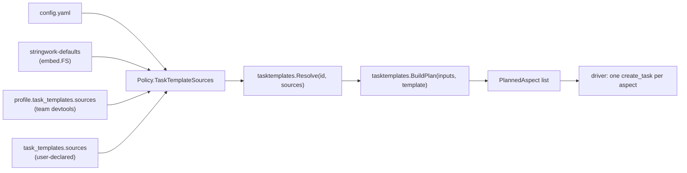

# Task Templates

Task templates are Stringwork's mechanism for **planning multi-aspect work** —
the kind of task that decomposes into several independent worker assignments
that can run in parallel. Code review is the canonical example: one PR yields
one worker per aspect (correctness, code-quality, security, …) and the driver
synthesizes the findings.

Like the [constitution](CONSTITUTION.md), templates are layered: Stringwork
ships sensible defaults, and teams overlay their own rules on top without
forking the binary.

## Mental model

A template is a recipe for "given inputs, decide which workers to spawn and
hand each one the right brief". The recipe lives entirely in YAML + markdown:

```
defaults/task-templates/code-review/
├── template.yaml         # id, title, inputs, ordered Aspects
├── classifiers.yaml      # file-glob → tag rules
├── routing.yaml          # tag → aspect-to-spawn rules
└── checklists/
    ├── correctness.md    # checklist embedded in the worker brief
    ├── code-quality.md
    └── ...
```

The planner takes this recipe plus a freeform input map (e.g.
`{files: [...], summary: "..."}`) and emits an ordered list of
`PlannedAspect` records — each one is the full payload for a single
`create_task` call.

## What ships out of the box

One template, baked into the binary as an embedded filesystem:

| Template      | Aspects                                                                              | Trigger                          |
|---------------|--------------------------------------------------------------------------------------|----------------------------------|
| `code-review` | correctness, code-quality, security, observability, data-model, performance          | call `task_plan` with files list |

`correctness` and `code-quality` always fire. The other four fire only when a
classifier tag matches:

| Tag             | Default classifier patterns                                          | Spawns aspect    |
|-----------------|----------------------------------------------------------------------|------------------|
| `SECURITY`      | `*secret*`, `*auth*`, `*credential*`, `*token*`                      | `security`       |
| `OBSERVABILITY` | `*metrics*`, `*tracing*`, `*logger*`, `*logging*`                    | `observability`  |
| `PROTO`         | `*.proto`                                                            | `data-model`     |
| `MIGRATION`     | `*.sql`, `**/migration/**`, `**/migrations/**`                       | `data-model`     |

`data-model` and `performance` are present in the template but `performance`
has no built-in classifier in the defaults — teams that care about
performance routing add their own classifier in their overlay (and a
matching routing rule). Without that, `task-template doctor` would warn
forever about a dead rule, so the default was pruned. See
[Override precedence](#override-precedence) below.

## CLI

Inspect templates and preview plans without ever spawning a worker:

```bash
mcp-stringwork task-template list
# → table of template id and contributing sources

mcp-stringwork task-template show code-review
# → merged view: aspects, classifiers, routing rules, source per row

mcp-stringwork task-template plan --template code-review --inputs ./inputs.yaml
# → "we'd spawn N aspects given these inputs", printable yaml dump

mcp-stringwork task-template doctor
# → validates merged templates and reports issues:
#   - routing rules referencing missing aspects
#   - tags referenced by routing but never emitted by classifiers
#   - duplicate ids within a single source
#   - oversized composed descriptions (4KB-per-aspect soft cap)
```

`task-template plan` accepts an `--inputs` YAML file shaped like this:

```yaml
files:
  - internal/auth/secret_helper.go
  - proto/account.proto
  - schema/migrations/001_init.sql
summary: rotate auth tokens
```

This is also the shape the `task_plan` MCP tool expects in its `inputs`
argument.

## MCP tool: `task_plan`

The driver calls `task_plan(template, inputs)` and gets back a structured
plan. The driver then iterates `aspects` and emits one `create_task` per
entry, copying `description`, `relevant_files`, and the new `template` /
`aspect` metadata fields straight through.

```json
{
  "template": "code-review",
  "tags": ["SECURITY", "PROTO"],
  "aspects": [
    {
      "template": "code-review",
      "aspect": "correctness",
      "title": "Correctness and Logic",
      "description": "## Code Review\n\n**Summary**: rotate auth tokens\n\n…",
      "relevant_files": ["internal/auth/secret_helper.go", "proto/account.proto"],
      "constraints": null,
      "finding_format": "### Finding format\n\n…",
      "spawned_by": ["always-correctness"]
    },
    …
  ],
  "notes": []
}
```

When zero aspects fire (all classifiers missed, every routing rule was
disabled), the planner returns an empty `aspects` list plus a `notes`
entry suggesting the caller verify the inputs with the `plan` CLI. The
driver should treat this as "no work needed" rather than as an error.

## Sources

Templates resolve through a stack of sources, in priority order:

1. **`stringwork-defaults`** — built-in `EmbedSource` baked into the binary.
   Always included; gives a brand-new install the `code-review` template
   even with no config.
2. **Profile sources** — declared in a team-shipped profile file referenced
   by `task_templates.profile`. One profile, N sources, in declaration
   order.
3. **User sources** — declared inline in `config.yaml` under
   `task_templates.sources`, in declaration order.

A typo in any one source is logged and skipped — the rest of the chain
keeps resolving. See [Operational notes](#operational-notes).

### Configuring sources

Add to `~/.config/stringwork/config.yaml`:

```yaml
task_templates:
  # Optional: a team-shared profile file (see "Team profiles" below).
  profile: ~/Development/regfin-devtools/stringwork.profile.yaml

  # Optional: inline user-level sources. Path tokens (~, $VAR, ${VAR})
  # are expanded; $PROFILE_DIR is ONLY available inside profile files.
  sources:
    - name: my-personal-templates
      type: dir            # only `dir` is supported in v1
      path: ~/work/personal-task-templates
```

`type: dir` is the only flavour today. `type: git` and `type: http` are
reserved discriminators so future flavours can land without breaking
existing configs.

### Team profiles (cross-team sharing)

Mirrors the [constitution profile](TEAM_RULES.md) model, but with a
separate top-level `task_templates:` block so a team can ship template
overlays without using the constitution and vice versa:

```yaml
# ~/Development/regfin-devtools/stringwork.profile.yaml
task_templates:
  sources:
    - name: regfin-code-review
      type: dir
      path: $PROFILE_DIR/task-templates
```

`$PROFILE_DIR` resolves to the directory of the profile file itself,
keeping the declaration portable across developers' clone paths.

## Override precedence

When the same template id appears in multiple sources, the merger
combines them with these rules:

| Component            | Merge semantics                                                                       |
|----------------------|---------------------------------------------------------------------------------------|
| `Aspect` (by id)     | Replace-by-id, **earlier-source-wins**. New ids from later sources are appended.      |
| `RoutingRule`        | Append; slice order preserved across sources (defaults first).                        |
| `Classifier`         | Append; slice order preserved across sources (defaults first).                        |
| `Checklist` per aspect | Concatenate in source declaration order, defaults first…                            |
| ↳ `replace: true`    | …unless a checklist file declares `replace: true` in its YAML front-matter, in which case the accumulated content is dropped and only the replacing body is kept (later sources still concatenate after a replace). |
| `InputDeclaration`   | First source wins outright. Teams that want to relax `required` keys must redeclare the inputs block. |

Earlier-source-wins for aspects means the **defaults** define the canonical
aspect ids — a team overlay declaring `id: correctness` does not replace
the default aspect's title and description; it is silently ignored. To
override a default aspect, override its **checklist** (concatenation or
`replace: true`), or disable the routing rule that spawns it. To add
brand-new aspects, give them new ids.

### Disabling a default

Set `disabled: true` on a routing rule or classifier:

```yaml
# In a team overlay's routing.yaml:
routing:
  - id: when-observability-tag
    disabled: true   # we don't want observability reviews; turn it off
```

The disabled rule stays on the merged template (so `doctor` can still
report it) but `BuildPlan` filters it out.

### Replacing a checklist body

By default a team checklist file *appends* to the default body. To wipe
the slate, declare YAML front-matter at the top of the file:

```markdown
---
replace: true
---
# Security (regfin)

This replaces the default security checklist entirely. The defaults
checklist content does not appear in the worker brief.
```

The parser is strict: `---` must open the file's first line and close on
its own line; a horizontal rule mid-document will not be misinterpreted
as front-matter.

## Authoring a new template

Drop a directory into one of your sources:

```
$PROFILE_DIR/task-templates/incident-triage/
├── template.yaml
├── classifiers.yaml      # optional
├── routing.yaml
└── checklists/
    ├── timeline.md
    ├── impact.md
    └── remediation.md
```

`template.yaml` minimum:

```yaml
id: incident-triage
title: Incident Triage
description: |
  Multi-aspect parallel triage for production incidents.

inputs:
  required: [incident_id]
  declarations:
    incident_id: string
    services: list

aspects:
  - id: timeline
    title: Build the Timeline
    description: |
      Reconstruct what happened, when, and which signals fired in what order.

  - id: impact
    title: Quantify Customer Impact
    description: |
      How many users, which markets, what surfaces, what dollar value.

  - id: remediation
    title: Plan Remediation
    description: |
      Short-term fix, follow-up actions, prevention proposal.
```

`routing.yaml` minimum:

```yaml
routing:
  - id: always-timeline
    when: always
    spawn: timeline
  - id: always-impact
    when: always
    spawn: impact
  - id: always-remediation
    when: always
    spawn: remediation
```

Run `mcp-stringwork task-template doctor` after editing — it catches
broken references before the next worker spawn does.

## Composed worker brief

The planner composes each aspect's `description` from these layers, in
order:

```
## <Template title>
**Summary**: <inputs.summary if provided>
**Detected tags**: <classifier tag set>
**Files in scope**:
- <file 1>
- ...

### Aspect: <Aspect title>
<Aspect.Description>

<Composed checklist body for this aspect>

### Additional focus  (one block per firing routing rule with ExtraFocus)
<RoutingRule.ExtraFocus>

### Finding format
<standard finding format — Severity / File / Issue / Suggestion>
```

A 4KB-per-aspect soft cap is enforced by `doctor` — `BuildPlan` never
silently truncates because the truncation point would surprise the
worker reading the brief.

## Operational notes

- **No daemon required.** `list`, `show`, `plan`, and `doctor` all read
  config + filesystem (or embedded FS) directly. They work whether or
  not the server is running.
- **Resolution is per-call, not cached.** `task_plan` resolves sources
  on every call so a freshly-edited overlay file shows up without a
  daemon restart. `Policy` does not (yet) maintain an mtime cache for
  templates because the planner only fires on interactive `task_plan`
  invocations, not the spawn hot path.
- **Bad declarations are skipped.** A typo in one source declaration
  logs to stderr and the rest of the chain continues to resolve.
- **No network on the hot path.** v1 only ships `type: dir` and the
  embedded `EmbedSource`. No source flavour reaches over the network.
- **Empty plan.** When zero aspects fire (all classifiers missed, every
  routing rule disabled), the planner returns an empty `aspects` list
  plus a `notes` entry. Drivers should treat this as "no work needed"
  rather than as an error.

## Resolution flow



## Relationship to the constitution

Both systems layer markdown files from defaults + team + user sources,
but they answer different questions:

| System          | Question                                                        | Resolution shape                          |
|-----------------|-----------------------------------------------------------------|-------------------------------------------|
| Constitution    | "What should every worker know before doing anything?"          | All matching files for a scope (kind/role) |
| Task templates  | "Given this kind of work, what aspects should we spawn?"        | One template by id, then a Plan           |

Hence `constitution.Resolve(sources, scope)` returns the full applicable
file set, while `tasktemplates.Resolve(id, sources)` returns one merged
template. Keep them parallel — they share the layered-source idea but
shouldn't be unified into a single abstraction.
